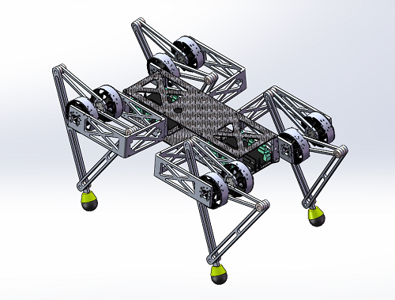

# QuadrupedalRobotFramework
This project is a imitation of minitaur.  
It is made by Robot team of Beihang University.  

## what the project do?
+ We publish the design drawings and program code for people who are interested in quadrupedal robots to learn.
+ We meet some difficulties in control method,and seek for help.

      
