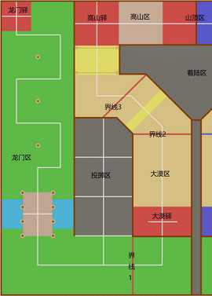
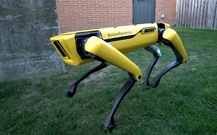
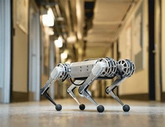
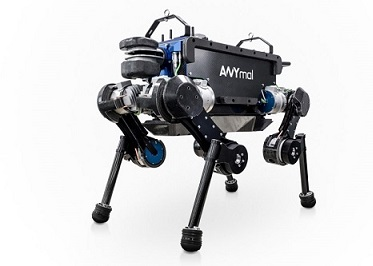
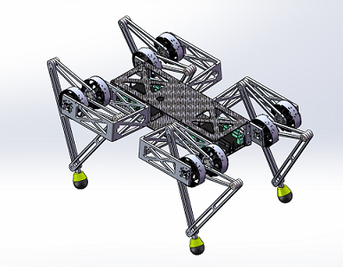
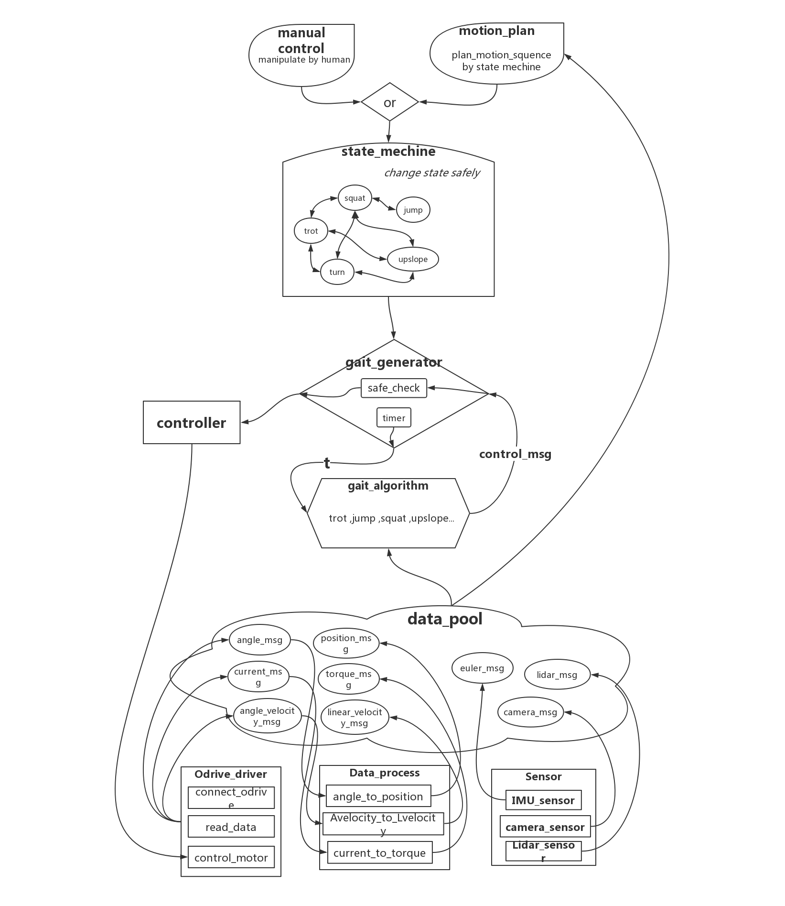

# 基于ROS的足式机器人软件框架设计
1. 什么是ROS?
2. 机器人零件
# 1.课题来源及意义
## 1.1 课题来源
本课题源自第十八届全国大学生机器人大赛的比赛题目，按照比赛要求，进行设计开发。
第十八届全国大学生机器人大赛以“快马加鞭”为主题，灵感来自古代传递信息的驿传制度。我国古代为接待来往官员和传递政府文书，军令设立了驿传制度，即每隔三十里设驿站，供人休息，食宿，换马所需。该制度始于秦，在汉，元，明等朝代不断发展，是我国古代信息传递的主要方式之一。
如今，信息时代的空前发展，我们渐渐忘记了这种古老的制度，本次机器人大赛通过机器人演绎驿传制度，让我们重温古老的记忆，感受中华文化的魅力。
## 1.2 大赛规则
比赛要求制作两台机器人：轮式机器人和四足机器人。分别完成比赛的前半程和后半程。本文主要研究四足机器人的控制框架设计，故只简述四足机器人所需完成的任务。
1）四足机器人接到令牌后，由大漠驿
   出发，穿过大漠区。
2）继续前行，越过沙丘（凸起的地形）
   ，草地（有绳子阻拦的地形）。
3）最后经过高山区（斜坡），到达山
顶区，结束比赛。

> 比赛地图
  

## 1.3 研究内容
本次毕业设计主要研究有关四足机器人从硬件层到控制层再到决策层的程序框架如何搭建，具体内容由底层到上层依次包括：
1. 直流无刷电机驱动的使用。设置驱动的各项参数，从驱动中读电机电流，编码器位置，电机速度等信息，向驱动发送控制信息（位置模式下发送位置信息，电流		模式下发送电流信息等等）。
2. 摄像头的使用。由摄像头感知机器人的路径信息，用以规划路径。
3. imu的使用。用以估计机器人的姿态
4. 机器人足端坐标与电机编码器位置的解算，机器人动力学与电机应提供力矩的解算，imu数据的滤波处理，摄像头视频流的有效信息提取，为运动控制算法做预备。
5. 利用下层传来的机器人各项数据，进行步态控制算法的设计（略）
6. 决策层根据不同地形，实现相应步态的切换，或更高层决策的转换。
7. 设计人机接口程序，方便调试。

## 1.4 实用意义
四足机器人对于地形有着轮式机器人无法比拟的超高适应能力，适合复杂地形的工作环境，可以在工厂里进行安全检查，在救灾现场进行被困人员的搜救，在居民楼中进行快递的配送等等。因此，近几年，越来越多的实验室，公司甚至个人开始研发足式机器人，可以预想该方向将来需要一个通用开发框架，使研发人员们避开繁琐或难以考虑周全的框架设计，专心于更高层的决策控制，从而缩短开发周期。
在足式机器人方面，波士顿动力，苏黎世大学，浙江大学等都取得了令人瞩目的进展，本文也是通过学习这些成功的设计，尝试总结出一个通用框架，为足式机器人领域，添块砖，加片瓦。

# 2. 题目调研与文献综述
## 2.1 足式机器人国内外发展现况
__BostonDynamic SpotMini__  

__MIT mini cheetah__  

__Zurich ANYmal__

## 我们的四足

### 流程图

