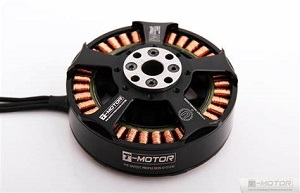
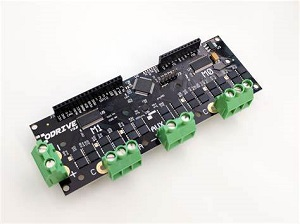
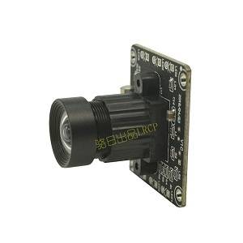
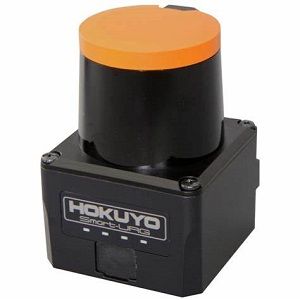

# 基于ROS的足式机器人软件框架设计
> 作者姓名：旦明迪  
> 学院名称：机械工程及自动化  
> 指导老师：梁建宏老师  
> 申请学位：工学学士  

# 1. 绪论
## 1.1 论文背景及目的
### 1.1.1课题来源
在工业化与信息化高度发达的今天，四足机器人的发展也日趋成熟。因此有越来越多
的实验室，公司或个人加入到了四足机器人
的研发中，原先四足机器人以液压伺服驱动为主，现在则多为直流无刷电机驱动。直
流无刷电机驱动具有体积小，无噪音等优势，是四足机器人产品化的一个巨大优势。
本课题依托于第十八届全国大学生机器人大赛ROBOCON的比赛，由北航机器人
队进行研发，计划设计出一个能实现基本步态的四足机器人。
第十八届全国大学生机器人大赛以“快马加鞭”为主题，灵感来自古代传递信息的驿传
制度。我国古代为接待来往官员和传递政府文书，军令设立了驿传制度以及为此而征发的徭役制度。驿传制度始于殷商，春秋战国已有邮驿，秦统一后广建驿道，邮驿发展迅速。汉承秦制，在通路上每30里置一驿站，供传递军事情报的官员途中食宿，换马之用。唐有车，马，船之分，设水驿，陆驿，水陆兼办三种。宋驿传由军队统管，设邮局，置日夜兼行的急递铺，专递送军事文书。元代设有蒙古站赤及汉地的驿站。明代清代进一步发展。直到光绪时期，随着新式邮政的建立，驿传制度逐渐被废止。
如今信息以光速高速传递，互联网所形成的逻辑上单一且巨大的全球化网络使我们不受空间限制并以多种形式进行信息交换。本次大赛用机器人演绎古代的信息传递方式，使我们重温古老的记忆，感受中华文化的魅力。
### 1.1.2 大赛规则
比赛在如下图所示的场地上进行，要求制作两台机器人，一台是轮式机器人，负责完成比赛的前半段，由于轮式机器人不是本文索要论述的对象，因此在这里略过不表。另一台是四足机器人，负责完成比赛的后半段，在接到轮式机器人传递的令牌后，通过一系列地形，到达终点后举起令牌，即为完成比赛，红蓝两队同时进行比赛，用时短者获胜。四足机器人为本文论述的主要对象，本文以研究如何构建控制框架为主，不包括对步态算法的深入研究。下面介绍四足机器人的比赛流程和具体的需要通过的地形。
首先四足机器人放置于大漠驿，等待轮式机器人交接令牌。在接到令牌后，由大漠驿出发，用对角步态穿过平坦的大漠区。
紧接着到达沙丘，需要先左转45度，正对沙丘，然后调整距离，切换跳跃步态，跳过沙丘。
之后对角步态走一小段路程后右转45度，正对绳子，切换跳跃步态跳过绳子。在成功抵达高山驿后，右转90度，切换爬坡步态，通过高山区，最后到达山顶区，此时举起令牌，宣布比赛结束。

> 比赛地图
  


### 1.1.3 项目用途及意义
四足机器人相较于六足，八足机器人而言，结构简单，系统冗余度小。相较于双足机器人，稳定性高，负载能力强，又有轮式机器人无法比拟的对地形极强的适应能力，因此适合复杂地形的工作
环境。可以用在工厂安全检查，在救灾现场进行被困人员的搜救，在居民楼中进
行快递的配送等等。因此，近几年，越来越多的实验室，公司甚至个人开始研发足式
机器人，可以预想该方向将来需要一个通用开发框架，使研发人员们避开繁琐或难以
考虑周全的框架设计，专心于更高层的决策控制，从而缩短开发周期。
在足式机器人方面，波士顿动力，麻省理工，苏黎世大学，浙江大学等都取得了令人瞩目的研究成果
，本文也是通过学习这些成功的设计，借鉴前人的设计思想和一些常用的技术手段，尝试总结出一个通用框架，方便后续的研究。
本文所述的框架是基于ROS的八自由度四足机器人的控制框架，对于十二自由度只需做稍微的修改也可以适用。将其直接部署在机器人上，就可以实现基本的运动步态，在此基础上，开发人员可以根据自己的需求设计更为复杂的步态算法和运动规划，这样极大节省了开发人员的时间。让越来越多的稍有编程基础的人，都可以加入到四足的研发当中来，降低了准入门槛，有利于促进该领域的蓬勃发展。


## 1.2 足式机器人国内外发展现况  
__BostonDynamic SpotMini__  


上图SpotMini是波士顿动力公司出品的一款电驱四足机器人，它轻巧灵敏，仅有30千克重，可负载14千克的重物，适用于家庭，办公室等场景，搭载了3D视觉，可以感知周围环境，能轻松完成诸如爬楼梯，开门等高难度动作。由于是全电驱的设计，使得SpotMini可以非常安静的运行，电驱也是四足机器人发展的主流，其优势已经慢慢超过了液压驱动的四足机器人，接下来的几款也同样是采用电驱的方案。

__MIT mini cheetah__  


上图minicheetah是麻省理工大学基于cheetah的改进版，是目前世界上首个能实现后空翻的四足机器人，它小巧灵活，仅9千克重

__Zurich ANYmal__


## 我们的四足


## 1.3 课题研究方法

依托机器人队的资金支持，计划设计一款八自由度机器人，在此基础上，进行软件框
架的开发与研究。
### 1.3.1 电机与电机驱动
    本课采用直流无刷电机T_motor,直流电机驱动Odirve。
T_motor  


Odrive  


### 1.3.2 摄像头和激光雷达
camera  


lidar - hokuyo  


### 1.3.3 ROS简介


## 1.4 论文构成及研究内容

所用软件，编程语言，技术储备。
程序框架，程序思路，程序优化。
> 第二章 软件架构一览  
> 第三章 数据读取和数据池的构建  
> 第四章 步态算法库概述  
> 第五章 状态切换自动机  
> 第六章 运动规划自动机  
> 第七章 实验参数一览  
> 第八章 改进建议与结论  
> 第九章 致谢  
> 第十章 参考文献  
> 第十一章 附录

# 2. 软件架构一览
### 流程图

# 3. 数据读取与数据池的构建
# 4. 步态算法库概述  
# 5. 状态切换自动机  
## 5.1 功能介绍
机器人的在运动的过程中，需要随时切换步态，而物理世界中的机器人由一个步态切
换到另外一个步态需要时间，和条件，步态切换自动机为切换步态提供了安全保
障，保证机器人快速，安全的进行步态的切换。步态切换自动机接收由控制层发送来
的目标步态集，经过计算得到一组切换路径，其中有若干个暂时步态集，之后依次发
送给步态生成器进行步态的切换。步态集被定义为一个类，其中包括一个步态所具有
的所有属性，比如步态的类型，步态的周期，步态的步长等。
## 5.2 原理介绍
步态切换自动机通过维护一个步态切换图来实现上述功能，其中各个步态为单独的一
个节点，可以直接切换的相邻步态之间用一条边连接，不能直接切换的步态之间无边
的连接。可以抽象为数据结构中的无向图结构。在此基础上，利用最短路径算法，在
给定当前状态(current_state)，目标状态(target_state)，的条件下，找出步态
切换的最短路径。然后逐个发送给步态生成器(gait_generator),按照最短路径的顺
序依次切换。
## 5.3 代码解析
```
hello
```
# 6. 运动规划自动机 
# 7. 实验参数一览
# 8. 改进建议与结论
# 9. 致谢
# 10. 参考文献
# 11. 附录
    你可以在github上获取到源码：  
    ```
    git clone git@github.com:buenos-dan/quadrupedal_robot.git
    ```
